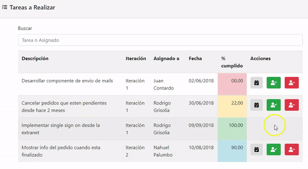
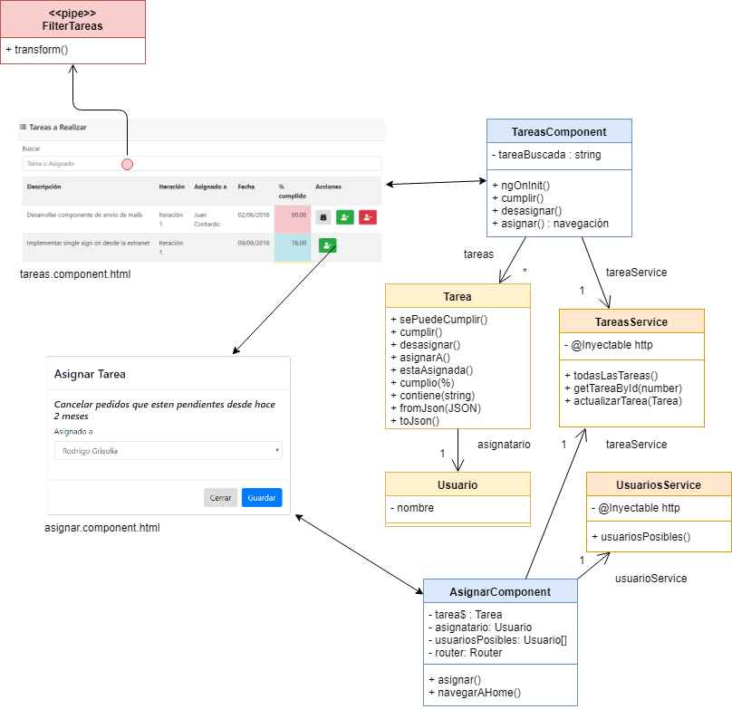
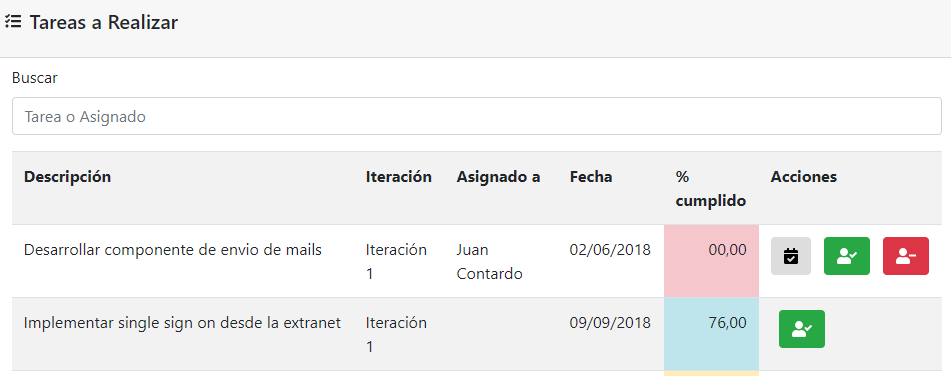
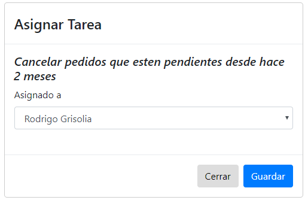

# Tareas de un equipo de desarrollo

[](https://travis-ci.org/uqbar-project/eg-tareas-angular)



Este ejemplo se basa en el seguimiento de tareas de un equipo de desarrollo y permite mostrar una aplicación completa en Angular con los siguientes conceptos

- **routing** de páginas master / detail de tareas
- utilización de Bootstrap 4 como framework de CSS + Font Awesome para los íconos
- desarrollo de front-end en Angular utilizando **servicios REST** desde el backend (por ejemplo, con [Spring Boot](https://spring.io/projects/spring-boot))
- para lo cual es necesario la inyección del objeto **httpClient** dentro de los objetos service
- la **separación de concerns** entre las tareas como objeto de dominio, la vista html, el componente que sirve como modelo de vista y el servicio que maneja el origen de los datos
- el manejo del **asincronismo** para recibir parámetros en la ruta, así como para disparar actualizaciones y consultas hacia el backend
- de yapa, repasaremos el uso de **pipes built-in** para formatear decimales en los números y uno propio para realizar el filtro de tareas en base a un valor ingresado

# Preparación del proyecto

## Levantar el backend

Pueden descargar [la implementación Spring Boot del backend](https://github.com/uqbar-project/eg-tareas-springboot). En el README encontrarán información de cómo levantar el servidor en el puerto 9000.

## Componentes adicionales

La instalación de los componentes adicionales luego de hacer `ng new eg-tareas-angular --routing` requiere instalar dependencias adicionales que podrás ver en el `package.json`. El ejemplo trabaja con Bootstrap y [font awesome para Angular](https://github.com/FortAwesome/angular-fontawesome) principalmente.

## Agregado en package.json

Es necesario incorporar Bootstrap 4 dentro del archivo _angular.json_ de la siguiente manera:

```json
    "styles": [
        "src/styles.css",
        "./node_modules/bootstrap/dist/css/bootstrap.min.css"
    ],
    "scripts": [
        "./node_modules/jquery/dist/jquery.slim.min.js",
        "./node_modules/bootstrap/dist/js/bootstrap.min.js"
    ]
```

## Configuración ruteo

La aplicación tendrá dos páginas:

- la vista master que muestra la lista de tareas (pendientes o cumplidas)
- y la vista de detalle que sirve para asignar un recurso a una tarea

Recordamos que se definen en el archivo _app/app-routing.module.ts_ que se crea cuando hacemos `ng new nombre-app --routing`:

```typescript
const routes: Routes = [
  { path: '', redirectTo: '/tareas', pathMatch: 'full' },
       // por defecto redirigimos a la lista de tareas
  { path: 'tareas',     component: TareasComponent },
  { path: 'asignarTarea/:id', component: AsignarComponent} 
       // pasamos id dentro de la URL para asignar una tarea específica
]

...

export const routingComponents = [ TareasComponent, AsignarComponent ]
```

## Configuración del NgModule

Los routing components se importan en el módulo (archivo _app/app.module.ts_):

```ts
import { AppRoutingModule, routingComponents } from './app-routing.module'

@NgModule({
  declarations: [
    AppComponent,
    routingComponents,
    ...
],
```

También es necesario que importemos las definiciones de Font Awesome, y esto incluye lamentablemente cada uno de los íconos que vayamos a utilizar. Otra opción es importar todos los íconos del framework, pero esta es una práctica totalmente desaconsejable, ya que produce que el _bundle_ sea bastante voluminoso. Un bundle es lo más parecido a un ejecutable web, y se genera en base a todas las definiciones que hacemos en nuestros archivos (los de typescript se traspilan a javascript soportados por cualquier browser). 

Creamos el módulo IconsModule y vemos cómo es el import de los íconos, que incluye la llamada a una biblioteca:

```typescript
import { FontAwesomeModule, FaIconLibrary } from '@fortawesome/angular-fontawesome'
import { faUserCheck, faUserMinus, faCalendarCheck, faTasks } from '@fortawesome/free-solid-svg-icons'

export class IconsModule {
  constructor(library: FaIconLibrary) {
    library.addIcons(faUserCheck, faUserMinus, faCalendarCheck, faTasks)
  }
}

```

Importamos esté modulo en _app.module.ts_ :

```typescript
import { IconsModule } from "./icons.module";

@NgModule({
   imports: [
    ...
    IconsModule,
  ],
}

```

Por último dado que vamos a formatear a dos decimales con coma el % de completitud de una tarea, debemos importar los _locales_ o configuraciones regionales:

```typescript
import '@angular/common/locales/global/es'
```

Además necesitamos importar el módulo HttpClientModule, que nos va a permitir conectarnos al backend.

# Resumen de la arquitectura



## Objetos de dominio

La tarea es un objeto de dominio al que podemos

- asignarle una persona
- determinar si se puede asignar, esto ocurre mientras no esté cumplida
- remover la asignación de la persona actual
- saber si se puede cumplir o remover su asignación, siempre que tenga una persona asignada y no esté cumplida
- marcarla como cumplida

Todas estas responsabilidades hacen que exista una clase Tarea, en lugar de un simple JSON. Pero además como vamos a recibir una Tarea desde el backend que sí es un JSON, vamos a incorporarle dos servicios: la exportación de un objeto Tarea a su correspondiente JSON y la importación de un JSON para crear un objeto tarea. El primero se implementa con un método de instancia toJSON(), el segundo requiere crear una tarea, por lo que el método fromJSON() es **estático**. El JSON del server tiene esta estructura:

```json
{
    "id": 1,
    "descripcion": "Desarrollar componente de envio de mails",
    "iteracion": "Iteración 1",
    "porcentajeCumplimiento": 0,
    "new": false,
    "asignadoA": "Juan Contardo",
    "fecha": "02/06/2018"
}
```

Para el caso de id, descripcion, iteracion, porcentajeCumplimiento y fecha, los campos devueltos coinciden con los nombres y tipos definidos para la clase Tarea. En cuanto al atributo **new** que es inyectado por el framework [Jackson](https://github.com/FasterXML/jackson), es descartado ya que el atributo id es el que se utiliza para saber si el objeto fue agregado a la colección del backend. Por último tenemos el campo **asignadoA**, que es un String vs. Tarea.asignatario que en el frontend apunta a un objeto Usuario. Entonces debemos adaptar este _gap_ de la siguiente manera:

- en el fromJson() debemos tomar el string y convertirlo a un objeto Usuario cuyo nombre será ese string. Actualizamos la variable asignatario con ese usuario.
- en el toJson() generamos un Json con un atributo "asignadoA" que contiene el nombre del usuario asignatario

Lo interesante es que **aparecen varias responsabilidades** que justifican de sobra la creación del objeto de dominio Tarea. Podés ver la implementación para más detalles.

La primera opción para implementar el método `fromJson` puede ser construir una tarea, y configurar a mano el nuevo objeto con lo que viene del backend:

```js
static fromJson(tareaJSON): Tarea {
  const result = new Tarea()
  result.id = tareaJSON.id
  result.descripcion = tareaJSON.descripcion
  result.asignatario = Usuario.fromJSON(tareaJSON.asignadoA)
  ...
  return result
}
```

Otra opción para construir una tarea como objeto de dominio con responsabilidades, es utilizar la técnica Object.assign, que pasa la información del segundo parámetro al primero (es una operación que tiene efecto colateral sobre el primer argumento). Es una opción más simple y vamos a preferirla a la hora de implementar nuestra solución:

```js
static fromJson(tareaJSON): Tarea {
  return Object.assign(new Tarea(), tareaJSON, { asignatario: Usuario.fromJSON(tareaJSON.asignadoA) })
}
```

## Servicios

Vamos a disparar pedidos a nuestro server local de Spring Boot ubicado en el puerto 9000. Pero no queremos repetir el mismo _endpoint_ en todos los lugares, entonces creamos un archivo _configuration.ts_ en el directorio services y exportamos una constante:

```typescript
export const REST_SERVER_URL = 'http://localhost:9000'
```

Esa constante la vamos a utilizar en todas las llamadas de nuestros services.

### TareasService

¿Qué necesitamos hacer?

- traer todas las tareas en la página principal (método GET)
- actualizar una tarea, tanto al cumplirla como en la asignación/desasignación (termina siendo un método PUT)
- y traer una tarea específica, esto será útil en la asignación, para mostrar los datos de la tarea que estamos asignando

Veamos cómo es la definición de TareasService:

```typescript
@Injectable({
  providedIn: 'root'
})
export class TareasService implements ITareasService {

  constructor(private http: HttpClient) { }

  async todasLasTareas() {
    const tareas = await this.http.get<Tarea[]>(REST_SERVER_URL + '/tareas').toPromise()
    return tareas.map((tarea) => Tarea.fromJson(tarea))
  }
```

- le inyectamos el objeto httpClient que es quien nos permite hacer pedidos GET, POST, PUT y DELETE siguiendo las convenciones REST.
- **@Injectable**: indica que nuestro service participa de la inyección de dependencias, y cualquiera que en su constructor escriba "tareasService" recibirá un objeto TareasService que además tendrá inyectado un objeto http (por ejemplo _tareas.component.ts_). La configuración providedIn: 'root' indica que el service _Singleton_ será inyectado por el NgModule sin necesidad de explícitamente definirlo en el archivo _app.module.ts_.

Esto y algunas novedades que trajo Angular 9, se explican acá: https://dev.to/christiankohler/improved-dependeny-injection-with-the-new-providedin-scopes-any-and-platform-30bb

Otro post (más largo): https://medium.com/@tomastrajan/total-guide-to-angular-6-dependency-injection-providedin-vs-providers-85b7a347b59f

Para traer todas las tareas, disparamos un pedido asincrónico al servidor: "http://localhost:9000/tareas". Eso no devuelve una lista de tareas: veamos cuál es la interfaz del método get en Http:

```javascript 
(method) (method) HttpClient.get<Tarea[]>(url: string, options?: Observable<Tarea[]>
```

Devuelve un "observable" que luego transformamos a "promesa" de una respuesta por parte del servidor. La instrucción `await` transforma ese pedido asincrónico en formato sincrónico (esto lo podemos hacer solo dentro de un método o función `async`, para más detalles te recomendamos leer [la explicación de promises y async/await de la materia](https://github.com/uqbar-project/eg-promises-electrodomesticos-ts)). **No es un pedido sincrónico**, ya que la línea siguiente `tareas.map...` no se ejecutará hasta tanto el servidor no devuelva la lista de tareas (se pausa esperando la respuesta).

Recibimos un _response_ del server, que si es 200 (OK) se ubicará en la variable tareas, que tipan a una lista de tareas, aunque no termina de ser exactamente objetos Tarea. Para eso las transformaremos a tareas con el método estático fromJson() de la clase Tarea. Si hay un error en el server (respuesta distinta de 200), la definición del método como `async` hace que se dispare una excepción...

```typescript
  async ngOnInit() {
    try {
      ...
      this.tareas = await this.tareasService.todasLasTareas()
    } catch (error) {
      mostrarError(this, error)
    }
  }
```

`tareas.component.ts`

(para eso conviene bajarse el proyecto backend y simular un error adrede)

```xtend
  @GetMapping(value="/tareas")
  def tareas() {
    if (1 == 1) throw new RuntimeException("Kaboom!")
    val tareas = RepoTareas.instance.allInstances
    ResponseEntity.ok(mapper.writeValueAsString(tareas))
  }
```

Del mismo modo el service define los métodos para leer una tarea por id y para actualizar, como vemos a continuación:

```typescript
async getTareaById(id: number) {
  const tarea = await this.http.get<Tarea>(REST_SERVER_URL + '/tareas/' + id).toPromise()
  return Tarea.fromJson(tarea)
}

async actualizarTarea(tarea: Tarea) {
  return this.http.put(REST_SERVER_URL + '/tareas/' + tarea.id, tarea.toJSON()).toPromise()
}
```

### UsuarioService

El service de usuarios sirve para traer la lista de usuarios en el combo de la página de asignación. También le inyectaremos el objeto `http` para hacer el pedido al backend, pero utilizaremos la técnica de **Promises** estándar: el método no devuelve la lista de usuarios, sino la promesa de una respuesta (Promise<Usuario[]>)...

```typescript
@Injectable({
  providedIn: 'root'
})
export class UsuariosService{

  constructor(private http: HttpClient) { }

  async usuariosPosibles() {
    return this.http.get<Usuario[]>(REST_SERVER_URL + '/usuarios').toPromise()
  }
}
```

Luego el componente de asignación debe convertir la respuesta en JSON con la lista de tareas como veremos más abajo.

## Casos de uso

### Lista de Tareas

La página inicial muestra la lista de tareas:



La vista html

- tiene binding bidireccional para sincronizar el valor de búsqueda (variable _tareaBuscada_),
- también tiene una lista de errores que se visualizan si por ejemplo hay error al llamar al service
- un ngFor que recorre la lista de tareas que sale de una llamada asincrónica al service: `await this.tareasService.todasLasTareas()`
- respecto a la botonera, tanto el cumplir como el desasignar actualizan el estado de la tarea en forma local y luego disparan un pedido PUT al server para sincronizar el estado...
- ...y por último la asignación dispara la llamada a una página específica mediante el uso del router

### Asignación de una persona a una tarea



En la asignación recibimos el id de la tarea, y pedimos al backend la tarea con ese id a través del TareaService. Eso nos sirve para mostrar información de la tarea que estamos actualizando pero además

- la lista de usuarios posibles que mostraremos como opciones del combo sale de una llamada al service propio para usuarios
- además queremos tener binding contra el elemento seleccionado del combo. Las opciones serían 1) que sea "tarea.asignatario", 2) que sea una referencia que vive dentro del componente de asignación: la variable asignatario. Elegimos la segunda opción porque es más sencillo cancelar sin que haya cambios en el asignatario de la tarea (botón Cancelar). En caso de Aceptar el cambio, aquí sí actualizaremos el asignatario de la tarea dentro de nuestro entorno local y luego haremos un pedido PUT al servidor para sincronizar la información.

```typescript
export class AsignarComponent {
  tarea: Tarea
  asignatario: Usuario
  usuariosPosibles = []
  errors = []

  async ngOnInit() {
    try {
      this.initialize()
    } catch (error) {
      this.errors.push(error.error)
    }

  }

  async initialize() {
    // Llenamos el combo de usuarios
    const usuarios = await this.usuariosService.usuariosPosibles()
    this.usuariosPosibles = usuarios.map(usuarioJson => new Usuario(usuarioJson.nombre))

    // Dado el identificador de la tarea, debemos obtenerlo y mostrar el asignatario en el combo
    const idTarea = this.route.snapshot.params['id']
    this.tarea = await this.tareasService.getTareaById(idTarea)
    this.asignatario = this.usuariosPosibles.find(usuarioPosible => this.tarea.estaAsignadoA(usuarioPosible))
  }

  validarAsignacion() {
    if (this.asignatario == null) {
      throw { error: "Debe seleccionar un usuario" }
    }
  }

  async asignar() {
    try {
      this.errors = []
      this.validarAsignacion()
      this.tarea.asignarA(this.asignatario)
      await this.tareasService.actualizarTarea(this.tarea)
      this.navegarAHome()
    } catch (e) {
      this.errors.push(e.error)
    }
  }

  navegarAHome() {
    this.router.navigate(['/tareas'])
  }

}
```

## Pipes

La página inicial permite filtrar las tareas:

```html
  <tr *ngFor="let tarea of tareas | filterTareas: tareaBuscada | orderTareas" class="animate-repeat">
```

El criterio de filtro delega a su vez en la tarea esa responsabilidad:

```typescript
export class FilterTareas implements PipeTransform {

  transform(tareas: Tarea[], palabra: string): Tarea[] {
    return tareas.filter(tarea => tarea.contiene(palabra))
  }

}
```

También tenemos el pipe orderTareas, que ordena las tareas por id:

```typescript
export class OrderTareas implements PipeTransform {

  transform(tareas: Tarea[]): Tarea[] {
    return tareas.sort((tarea, otraTarea) => tarea.id - otraTarea.id)
  }

}
```

Por último, el % de cumplimiento se muestra con dos decimales y con comas, mediante el pipe estándar de Angular:

```html
  <span class="text-xs-right">{{tarea.porcentajeCumplimiento | number:'2.2-2':'es' }}</span>
```

# Testing

El testeo requiere una parte burocrática que es repetir la importación de todos los elementos del NgModule y los particulares de TareasComponent en nuestro spec. El lector puede ver la lista de imports completa en el archivo [tareas.component.spec.ts](src/components/tareas/tareas.component.spec.ts).

## Inyección de un stub service

Queremos mantener la unitariedad de los tests y cierto grado de determinismo que nos permita tener un entorno controlado de eventos y respuestas. Dado que nuestro service real hace una llamada http, vamos a

- definir una interfaz general ITareasService con tres servicios básicos (en el archivo _tareas.service.ts_)

```typescript
export interface ITareasService {
  todasLasTareas(): Promise<Tarea[]>
  getTareaById(id: number) : Promise<Tarea>
  actualizarTarea(tarea: Tarea): void
}
```

- luego generaremos un stub de nuestro TareasService que trabajará con datos fijos (archivo _stubs.service.ts_)

```typescript
export const juana = new Usuario('Juana Molina')

export class StubTareasService implements ITareasService {
  tareas = [
    new Tarea(1, 'Tarea 1', 'Iteracion 1', juana, '10/05/2019', 50),
    new Tarea(2, 'Tarea 2', 'Iteracion 1', null, '13/08/2019', 0)
  ]

  async todasLasTareas() {
    return this.tareas
  }

  async getTareaById(id: number) {
    return this.tareas.find((tarea) => tarea.id === id)
  }

  actualizarTarea(tarea: Tarea) { }
}
```

Fíjense que el método _todasLasTareas()_ no devuelve una lista de tareas, sino una Promise de una lista de tareas (determinado por el mecanismo `async`).

- la clase TareasService implementará la nueva interfaz (archivo _tareas.service.ts_)

```typescript
export class TareasService implements ITareasService {
```

No es estrictamente necesario que stub y tarea implementen la misma interfaz, porque internamente Javascript no tiene chequeo estricto de tipos, pero didácticamente nos sirve como ejemplo de uso de interfaz de ES6 y nos permite ser más explícito en la definición de tipos, así que como primer acercamiento nos es útil. En la práctica ustedes pueden obviar este paso para no hacerlo tan burocrático.

Ahora sí, en nuestro archivo de test tenemos que inyectarle al constructor del componente el stub del service:

```typescript
constructor(private tareasService: TareasService, private router: Router) { }
```

Para eso debemos pisar el servicio a inyectar en el método beforeEach de nuestro test, de la siguiente manera:

```typescript
  TestBed.overrideComponent(TareasComponent, {               // línea 1
    set: {
      providers: [
        { provide: TareasService, useClass: StubTareasService }
      ]
    }
  })
  
  fixture = TestBed.createComponent(TareasComponent)          // línea 2
```

Es importante el orden aquí, si instanciamos el componente primero (la línea 2) ya no será posible modificar el servicio a inyectar y veremos un error al correr nuestros tests:

```bash
Failed: Cannot override component metadata when the test module has already been instantiated. Make sure you are not using `inject` before `overrideComponent`.
```

Recordamos que se corren los tests mediante

```bash
ng test --sourceMap=false --watch
```

Otra opción, si queremos tener acceso al stub y manipularlo, debemos crear nosotros el stub y luego pasárselo al componente de la siguiente manera:

```typescript
  const stubTareasService = new StubTareasService
  
  TestBed.overrideComponent(TareasComponent, {
    set: {
      providers: [
        { provide: TareasService, useValue: stubTareasService }
      ]
    }
  })
```

La referencia stubTareasService la podemos crear dentro del beforeEach o bien puede ser una variable de instancia dentro del test.

## Otras configuraciones

Dado que estamos utilizando el framework de routing de Angular, es importante agregar la configuración de nuestra ruta por defecto dentro de los providers del componente que genera el TestBed:

```typescript
  beforeEach(async(() => {
    TestBed.configureTestingModule({
      declarations: [ ... ],
      imports: [ ... ],
      providers: [
       { provide: APP_BASE_HREF, useValue: '/' }
      ]
    })
    ...
``` 

De lo contrario te aparecerá el siguiente mensaje de error al correr los tests:

```bash
Failed: No base href set. Please provide a value for the APP_BASE_HREF token or add a base element to the document.
```

## Tests

### Stub service bien inyectado

Veamos los tests más interesantes: este prueba que el stub service fue inyectado correctamente

```typescript
  it('should show 2 pending tasks', () => {
    expect(2).toBe(component.tareas.length)
  })
```

Dado que el stub genera dos tareas, el componente debe tenerlas en su variable tareas (que no es privada para poder ser accedidas desde el test).

### Verificar que una tarea puede cumplirse

El segundo test prueba que una tarea que no está cumplida y está asignada puede marcarse como cumplida:

```typescript
  it('first task could be mark as done', () => {
    const resultHtml = fixture.debugElement.nativeElement
    expect(resultHtml.querySelector('#cumplir_1')).toBeTruthy()
  })
```

En la vista agregamos un identificador para el botón cumplir de cada tarea, que consiste en el string "cumplir_" concatenado con el identificador de la tarea:

```html
  <button type="button" title="Marcarla como cumplida" class="btn btn-default" (click)="cumplir(tarea)" aria-label="Cumplir"
    *ngIf="tarea.sePuedeCumplir()" id="cumplir_{{tarea.id}}">
```

Así es fácil preguntar si la tarea 1 puede cumplirse: debe existir un tag con id "cumplir_1" dentro del HTML que genera el componente.

Dejamos [aquí](https://developer.mozilla.org/es/docs/Web/API/Document/querySelector) el link para entender las búsquedas que soporta querySelector.

### Cumplir una tarea

¿Qué pasa si queremos marcar una tarea como cumplida?

- hacemos click sobre el botón cumplir
- esto debería mostrar el porcentaje de cumplimiento de dicha tarea con 100

Bueno, no exactamente 100, sino "100,00" porque le aplicamos un filter. Aquí vemos que el testeo que estamos haciendo involucra no es tan unitario, sino más bien end-to-end, ya que se prueba componente, objeto de dominio (que es quien cumple la tarea), el pipe de Angular que customizamos a dos decimales y con coma decimal y la vista html:

```typescript
  it('mark first task as done', () => {
    const resultHtml = fixture.debugElement.nativeElement
    resultHtml.querySelector('#cumplir_1').click()
    fixture.detectChanges()
    expect(resultHtml.querySelector('#porcentaje_1').textContent).toBe("100,00")
  })
```

A la vista le agregamos un id para poder encontrar el porcentaje de cumplimiento dentro de la tabla:

```html
<span class="text-xs-right" id="porcentaje_{{tarea.id}}">{{tarea.porcentajeCumplimiento | number:'2.2-2':'es' }}</span>
```

Recordemos que siempre que podamos vamos a tratar de utilizar el atributo `data-testid` para seleccionar los elementos HTML que nos interesa manipular en cada test. En este caso, dado que generamos identificadores dinámicamente, debemos utilizar el `id` ya que el motor de Angular pisa los `data` que incluyan código en javascript con expresiones propias del framework.

### Búsqueda de tareas

Si buscamos "2", debería traernos únicamente la "Tarea 2". No podemos preguntar si la lista de tareas tiene un solo elemento, porque el componente siempre tiene las dos tareas y el que filtra es nuestro TareasPipe en su método transform. Entonces lo que vamos a hacer es buscar todos los elementos con data-testid "fila-tarea" que tienen nuestros tr en la vista _tareas.component.html_:

```html
<tr 
  data-testid="fila-tarea"
  *ngFor="let tarea of tareas | filterTareas: tareaBuscada | orderTareas"
  class="animate-repeat">
```

de la siguiente manera:

```typescript
  it('searching for second task should have one tr in tasks list', () => {
    component.tareaBuscada = '2'
    fixture.detectChanges()
    const resultHtml = fixture.debugElement.nativeElement
    expect(resultHtml.querySelectorAll('[data-testid="fila-tarea"]').length).toBe(1)
  })
```

Aquí utilizamos querySelectorAll() que devuelve la lista de elementos html que cumplen nuestro criterio de búsqueda.

Dejamos al lector que siga revisando los otros tests, que tienen características similares.
