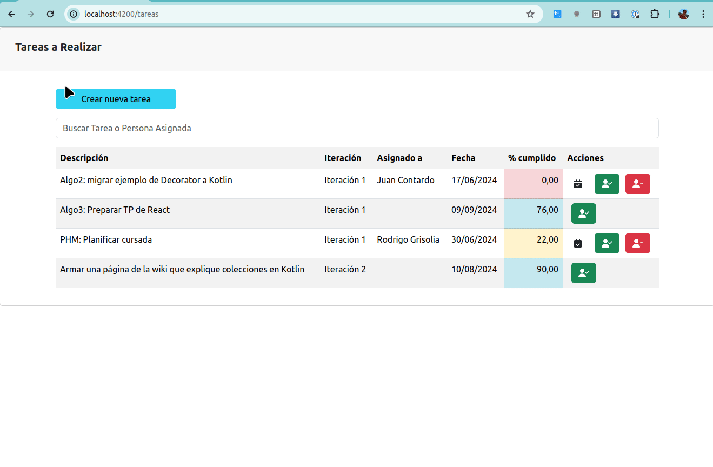

# Tareas de un equipo de desarrollo

[](https://github.com/uqbar-project/eg-tareas-angular/actions/workflows/build.yml) [](https://codecov.io/gh/uqbar-project/eg-tareas-angular)



Este ejemplo se basa en el seguimiento de tareas de un equipo de desarrollo y permite mostrar una aplicación completa en Angular con los siguientes conceptos

- **routing** para navegar desde la página principal a las que nos permiten crear o asignar una tarea, así como para volver
- utilización de Bootstrap como framework de CSS + Font Awesome para los íconos
- desarrollo de front-end en Angular utilizando **servicios REST** desde el backend (por ejemplo, con [Spring Boot](https://spring.io/projects/spring-boot))
- para lo cual es necesario la inyección del objeto **httpClient** dentro de los objetos service, trabajando con **asincronismo** para disparar actualizaciones y consultas hacia el backend
- la **separación de concerns** entre las tareas como objeto de dominio, la vista html, el componente que sirve como modelo de vista y el servicio que maneja el origen de los datos
- de yapa, repasaremos el uso de **pipes built-in** para formatear decimales en los números y uno propio para realizar el filtro de tareas en base a un valor ingresado

# Preparación del proyecto

## Levantar el backend

Pueden descargar [la implementación Spring Boot del backend](https://github.com/uqbar-project/eg-tareas-springboot-kotlin). En el README encontrarán información de cómo levantar el servidor en el puerto 9000.

## Componentes adicionales

La instalación de los componentes adicionales luego de hacer `ng new eg-tareas-angular --routing` requiere instalar dependencias adicionales. El ejemplo trabaja con Bootstrap y [font awesome para Angular](https://github.com/FortAwesome/angular-fontawesome) principalmente.

```bash
npm i @fortawesome/angular-fontawesome @fortawesome/fontawesome-svg-core @fortawesome/free-solid-svg-icons bootstrap
```

## Configuración angular.json

Es necesario incorporar Bootstrap dentro del archivo _angular.json_:

```json
    "styles": [
        "src/styles.css",
        "./node_modules/bootstrap/dist/css/bootstrap.min.css"
    ],
    "scripts": [
        "./node_modules/bootstrap/dist/js/bootstrap.min.js"
    ]
```

## Configuración ruteo

La aplicación tendrá las siguientes páginas:

- la vista principal que muestra la lista de tareas (pendientes o cumplidas)
- una vista que nos permite crear una nueva tarea
- y la vista de detalle que sirve para asignar un recurso a una tarea

Pueden ver la configuración en el archivo [routes](./src/app/app.routes.ts), donde en caso de no encontrar un path exacto redirigimos a la página principal:

```typescript
const routes: Routes = [
  { path: 'tareas',           component: TareasComponent },
  ...
  { path: '', redirectTo: '/tareas', pathMatch: 'full' },
       // por defecto redirigimos a la lista de tareas
]
```

## Configuración de la vista principal

Es necesario que importemos las definiciones de Font Awesome, y esto incluye lamentablemente cada uno de los íconos que vayamos a utilizar. Otra opción es importar todos los íconos del framework, pero esta es una práctica totalmente desaconsejable, ya que produce que el _bundle_ sea bastante voluminoso. Un bundle es lo más parecido a un ejecutable web, y se genera en base a todas las definiciones que hacemos en nuestros archivos (los de typescript se traspilan a javascript soportados por cualquier browser). 

Creamos el módulo IconsModule y vemos cómo es el import de los íconos, que incluye la llamada a una biblioteca:

```typescript
@NgModule({
  imports: [FontAwesomeModule],
  exports: [FontAwesomeModule],
})
export class IconsModule {
  constructor(library: FaIconLibrary) {
    library.addIcons(faUserCheck, faUserMinus, faCalendarCheck, faTasks)
  }
}
```

Importamos esté modulo en [_tareas.component.ts_](./src/app/tareas/tareas.component.ts):

```typescript
@Component({
  selector: 'app-tareas',
  standalone: true,
  imports: [CommonModule, FormsModule, RouterModule, FilterTareas, OrderTareas, IconsModule],
  ...
```

Por último dado que vamos a formatear a dos decimales con coma el % de completitud de una tarea, debemos importar los _locales_ o configuraciones regionales. Esto lo hacemos en el archivo [main.ts](./src/main.ts) para que sea global en toda la aplicación:

```typescript
import '@angular/common/locales/global/es'
```

Además necesitamos importar el módulo HttpClientModule, que nos va a permitir conectarnos al backend.

# Resumen de la arquitectura


## Objetos de dominio

La tarea es un objeto de dominio al que podemos

- asignarle una persona
- determinar si se puede asignar, esto ocurre mientras no esté cumplida
- remover la asignación de la persona actual
- saber si se puede cumplir o remover su asignación, siempre que tenga una persona asignada y no esté cumplida
- marcarla como cumplida

Todas estas responsabilidades hacen que exista una clase Tarea, en lugar de un simple JSON. Pero además como vamos a recibir una Tarea desde el backend que sí es un JSON, vamos a incorporarle dos servicios: la exportación de un objeto Tarea a su correspondiente JSON y la importación de un JSON para crear un objeto tarea. El primero se implementa con un método de instancia toJSON(), el segundo requiere crear una tarea, por lo que el método fromJSON() es **estático**. El JSON del server tiene esta estructura:

```json
{
  "id": 1,
  "descripcion": "Algo2: migrar ejemplo de Decorator a Kotlin",
  "iteracion": "Iteración 1",
  "porcentajeCumplimiento": 0,
  "asignadoA": "Juan Contardo",
  "fecha": "21/06/2024"
}
```

Para el caso de id, descripcion, iteracion, porcentajeCumplimiento y fecha, los campos devueltos coinciden con los nombres y tipos definidos para la clase Tarea. Por último tenemos el campo **asignadoA**, que es un String vs. Tarea.asignatario que en el frontend apunta a un objeto Usuario. Entonces debemos adaptar este _gap_ de la siguiente manera:

- en el fromJson() debemos tomar el string y convertirlo a un objeto Usuario cuyo nombre será ese string. Actualizamos la variable asignatario con ese usuario.
- en el toJson() generamos un Json con un atributo "asignadoA" que contiene el nombre del usuario asignatario

Lo interesante es que **aparecen varias responsabilidades** que justifican de sobra la creación del objeto de dominio Tarea. Podés ver la implementación para más detalles.

La primera opción para implementar el método `fromJson` puede ser construir una tarea, y configurar a mano el nuevo objeto con lo que viene del backend:

```js
static fromJson(tareaJSON): Tarea {
  const result = new Tarea()
  result.id = tareaJSON.id
  result.descripcion = tareaJSON.descripcion
  result.asignatario = Usuario.fromJSON(tareaJSON.asignadoA)
  ...
  return result
}
```

Otra opción para construir una tarea como objeto de dominio con responsabilidades, es utilizar la técnica [Object.assign](https://developer.mozilla.org/en-US/docs/Web/JavaScript/Reference/Global_Objects/Object/assign), que permite construir una copia de un objeto en base a la unión de todos los atributos que enumeremos. Es una opción más simple y vamos a preferirla a la hora de implementar nuestra solución:

```ts
static fromJson(tareaJSON): Tarea {
  return Object.assign(new Tarea(), tareaJSON, { asignatario: Usuario.fromJSON(tareaJSON.asignadoA) })
}
```

## Servicios

Vamos a disparar pedidos a nuestro server local de Spring Boot ubicado en el puerto 9000. Pero no queremos repetir el mismo _endpoint_ en todos los lugares, entonces creamos un archivo _configuration.ts_ en el directorio services y exportamos una constante:

```ts
export const REST_SERVER_URL = 'http://localhost:9000'
```

Esa constante la vamos a utilizar en todas las llamadas de nuestros services.

### TareasService

¿Qué necesitamos hacer?

- traer todas las tareas en la página principal (método GET)
- actualizar una tarea, tanto al cumplirla como en la asignación/desasignación (termina siendo un método PUT)
- traer una tarea específica, esto será útil en la asignación, para mostrar los datos de la tarea que estamos asignando
- y crear una tarea (método POST)

Veamos cómo es la definición de TareasService:

```typescript
@Injectable({
  providedIn: 'root'
})
export class TareasService implements ITareasService {

  constructor(private httpClient: HttpClient) { }

  async todasLasTareas() {
    const tareas$ = this.httpClient.get<TareaJSON[]>(REST_SERVER_URL + '/tareas')
    const tareas = await lastValueFrom(tareas$)
    return tareas.map((tareaJSON) => Tarea.fromJson(tareaJSON))
  }
```

- le inyectamos el objeto httpClient que es quien nos permite hacer pedidos GET, POST, PUT y DELETE siguiendo las convenciones REST.
- **@Injectable**: indica que nuestro service participa de la inyección de dependencias, y cualquiera que en su constructor escriba "tareasService" recibirá un objeto TareasService que además tendrá inyectado un objeto http (por ejemplo _tareas.component.ts_). La configuración providedIn: 'root' indica que el service _Singleton_ será inyectado por el NgModule sin necesidad de explícitamente definirlo en el archivo _app.module.ts_.

Esto y algunas novedades que trajo Angular 9, se explican 

- [en este artículo](https://dev.to/christiankohler/improved-dependeny-injection-with-the-new-providedin-scopes-any-and-platform-30bb).
- [y este post más largo](https://medium.com/@tomastrajan/total-guide-to-angular-6-dependency-injection-providedin-vs-providers-85b7a347b59f)

Para traer todas las tareas, disparamos un pedido asincrónico al servidor: `http://localhost:9000/tareas`. Eso no devuelve una lista de tareas: veamos cuál es la interfaz del método get en Http:

```javascript 
(method) (method) HttpClient.get<Tarea[]>(url: string, options?: Observable<Tarea[]>
```

Devuelve un "observable" que luego transformamos a "promesa" de una respuesta por parte del servidor (mediante la función `lastValueFrom` de RxJs). La instrucción `await` transforma ese pedido asincrónico en formato sincrónico (esto lo podemos hacer solo dentro de un método o función `async`, para más detalles te recomendamos leer [la explicación de promises y async/await de la materia](https://github.com/uqbar-project/eg-promises-electrodomesticos-ts)). **No es un pedido sincrónico**, ya que la línea siguiente `tareas.map...` no se ejecutará hasta tanto el servidor no devuelva la lista de tareas (se pausa esperando la respuesta).

Recibimos un _response_ del server, que si es 200 (OK) se ubicará en la variable tareas, que tipan a una lista de tareas, aunque no termina de ser exactamente objetos Tarea. Para eso las transformaremos a tareas con el método estático fromJson() de la clase Tarea. Si hay un error en el server (respuesta distinta de 200), la definición del método como `async` hace que se dispare una excepción...

```typescript
  async ngOnInit() {
    await this.obtenerTodasLasTareas()
  }

    async obtenerTodasLasTareas() {
    try {
      this.tareas = await this.tareasService.todasLasTareas()
    } catch (error) {
      mostrarError(this, error)
    }
  }
```

`tareas.component.ts`

(para eso conviene bajarse el proyecto backend y simular un error adrede)

```kt
@PutMapping("/tareas/{id}")
@Operation(summary = "Permite actualizar la información de una tarea")
fun actualizar(@PathVariable id: Int, @RequestBody tareaBody: Tarea): Tarea {
  if (true) throw RuntimeException("pepe")
  return tareasService.actualizar(id, tareaBody)
}
```

Del mismo modo el service define los métodos para leer una tarea por id y para actualizar, como pueden ver [en la implementación](./src/services/tareas.service.ts).

En el caso de la actualización de tareas, envolvemos la promise dentro de una función async que captura la excepción y la muestra al usuario:

```ts
async actualizarTarea(..., tarea: Tarea) {
  ... 
  try {
    await this.tareasService.actualizarTarea(tarea)
  } catch (e) {
    await errorHandler(this, e as unknown as Error)
  }
}
```

Tenemos una función errorHandler que permite mostrar un mensaje de error y volver a cargar las tareas (como se puede ver, se envuelve en un try/catch vacío por si falla la operación, así nos concentramos en mostrar el mensaje de error original).

```ts
export const errorHandler = async (component: TareasComponent, error: Error) => {
  try {
    component.tareas = await component.tareasService.todasLasTareas()
  } catch (e) {}
  mostrarError(component, error)
}
```

## Casos de uso

### Lista de Tareas

La página inicial muestra la lista de tareas:


La vista html

- tiene binding bidireccional para sincronizar el valor de búsqueda (variable _tareaBuscada_),
- también tiene una lista de errores que se visualizan si por ejemplo hay error al llamar al service
- un `@for` que recorre la lista de tareas que sale de una llamada asincrónica al service: `await this.tareasService.todasLasTareas()`
- respecto a la botonera, tanto el cumplir como el desasignar actualizan el estado de la tarea en forma local y luego disparan un pedido PUT al server para sincronizar el estado...
- ...y por último la asignación dispara la llamada a una página específica mediante el uso del router

### Asignación de una persona a una tarea


En la asignación recibimos el id de la tarea, y pedimos al backend la tarea con ese id a través del TareaService. Eso nos sirve para mostrar información de la tarea que estamos actualizando pero además

- la lista de usuarios posibles que mostraremos como opciones del combo sale de una llamada al service propio para usuarios
- además queremos tener binding contra el elemento seleccionado del combo. Las opciones serían 1) que sea "tarea.asignatario", 2) que sea una referencia que vive dentro del componente de asignación: la variable asignatario. Elegimos la segunda opción porque es más sencillo cancelar sin que haya cambios en el asignatario de la tarea (botón Cancelar). En caso de Aceptar el cambio, aquí sí actualizaremos el asignatario de la tarea dentro de nuestro entorno local y luego haremos un pedido PUT al servidor para sincronizar la información.

## Pipes

La página inicial permite filtrar las tareas:

```html
  @for (tarea of tareas | filterTareas: tareaBuscada | orderTareas ; track tarea; let i = $index) {
    <tr>
```

El criterio de filtro delega a su vez en la tarea esa responsabilidad:

```ts
export class FilterTareas implements PipeTransform {

  transform(tareas: Tarea[], palabra: string): Tarea[] {
    return tareas.filter(tarea => tarea.contiene(palabra))
  }

}
```

También tenemos el pipe orderTareas, que ordena las tareas por id:

```ts
export class OrderTareas implements PipeTransform {

  transform(tareas: Tarea[]): Tarea[] {
    return tareas.sort((tarea, otraTarea) => tarea.key() - otraTarea.key())
  }

}
```

La tarea es responsable de devolver un valor para el método key() con el que el pipe lo ordena.

Por último, el % de cumplimiento se muestra con dos decimales y con comas, mediante el pipe estándar de Angular:

```html
  <span class="text-xs-right">{{tarea.porcentajeCumplimiento | number:'2.2-2':'es' }}</span>
```

# Testing

## Inyección de un stub para el httpClient

Queremos mantener la unitariedad de los tests y cierto grado de determinismo que nos permita tener un entorno controlado de eventos y respuestas. Dado que nuestro service real hace una llamada http, 

1. podríamos generar un stub del TareasService que maneje datos controlables

```ts
export const juana = new Usuario('Juana Molina')

export class StubTareasService implements ITareasService {
  tareas = [
    new Tarea(1, 'Tarea 1', 'Iteracion 1', juana, '10/05/2019', 50),
    new Tarea(2, 'Tarea 2', 'Iteracion 1', null, '13/08/2019', 0)
  ]

  async todasLasTareas() {
    return this.tareas
  }

  async getTareaById(id: number) {
    return this.tareas.find((tarea) => tarea.id === id)
  }

  async actualizarTarea(tarea: Tarea) { }
}
```

2. pero nos parece mejor generar un stub del `httpClient` inyectado en nuestro TareasService, de manera de poder aumentar el nivel de cobertura de nuestros tests de frontend.

Ahora sí, para que la inyección de dependencias reemplace nuestro objeto stub de httpClient, vamos a crear un **spy** de Jasmine en un archivo aparte, indicando cuáles son los valores que deberíamos esperar:

- en el caso de hacer un get de tareas, tiene que devolver un `Observable` de muchas tareas
- en el caso de hacer un get de una tarea, tiene que devolver un `Observable` de una tarea específica

```ts
export const getHttpClientSpy = () => {
  const httpClientSpy = jasmine.createSpyObj('HttpClient', [
    'get',
    'put',
    'post'
  ])

  httpClientSpy.get
    .withArgs(`${REST_SERVER_URL}/tareas`)
    .and.returnValue(of(tareasStub))
  
  httpClientSpy.get
    .withArgs(`${REST_SERVER_URL}/tareas/1`)
    .and.returnValue(of(tareasStub[0]))

  // Incluso podemos controlar la búsqueda de usuarios:
  httpClientSpy.get
    .withArgs(`${REST_SERVER_URL}/usuarios`)
    .and.returnValue(of(usuariosStub))
  
  httpClientSpy.put.and.returnValue(of(tareasStub[0]))
 
  // En el caso del alta, nos permite incluso construir una función para simular un id nuevo:
  // eslint-disable-next-line @typescript-eslint/no-explicit-any
  httpClientSpy.post.and.callFake((_url: string, body: any) =>
    of({ ...body, id: 3 })
  )
  return httpClientSpy
}
```

Luego vamos a configurar **providers** en nuestro objeto TestBed, definiendo cuál es el objeto que debe inyectarse cuando alguna dependencia lo necesite:

- el router, que va a tener un **spy** para poder hacer tests sobre la navegación
- y el httpClient como dijimos antes

```ts
describe('TareasComponent', () => {
  ...
  let routerSpy: jasmine.SpyObj<Router>
  let httpClientSpy: jasmine.SpyObj<HttpClient>
  
  beforeEach(async () => {
    routerSpy = jasmine.createSpyObj('Router', ['navigate', 'navigateByUrl'])
    // vamos a crear una nueva instancia del spy de httpClient para cada test
    // esto es importante porque hay un test que le cambia dinámicamente el comportamiento
    // para que tire error, y no queremos que ese cambio tenga efecto colateral en los demás tests
    httpClientSpy = getHttpClientSpy()

    TestBed.configureTestingModule({
      declarations: [
        ...
      ],
      providers: [
        { provide: HttpClient, useValue: httpClientSpy },
        { provide: Router, useValue: routerSpy }
      ]      
    }).compileComponents()
    ....
  })
```

## Tests

### Stub service bien inyectado

Veamos los tests más interesantes: este prueba que el stub del http client fue inyectado correctamente, porque el método GET de http `/tareas` devuelve 2 tareas:

```ts
it('should initially show 2 pending tasks', (() => {
  expect(2).toBe(component.tareas.length)
}))
```

### Verificar que una tarea puede cumplirse

El segundo test prueba que una tarea que no está cumplida y está asignada puede marcarse como cumplida:

```ts
it('first task can be marked as done', () => {
  expect(getByTestId('cumplir_1')).toBeTruthy()
})
```

En la vista agregamos un `attr.data-testid` para el botón cumplir de cada tarea, que consiste en el string "cumplir_" concatenado con el identificador de la tarea:

```html
@if (tarea.sePuedeCumplir()) {
  <button id="cumplirTarea" type="button" title="Marcarla como cumplida" class="btn btn-default" (click)="cumplir(tarea)"
    aria-label="Cumplir" [attr.data-testid]="'cumplir_' + tarea.id">
    ...
```

Así es fácil preguntar si la tarea 1 puede cumplirse: debe existir un tag cuyo atributo `data-testid` sea "cumplir_1" dentro del HTML que genera el componente. Podés investigar la función que busca por id, y te dejamos [el link](https://developer.mozilla.org/es/docs/Web/API/Document/querySelector) para entender las búsquedas que soporta querySelector.

### Cumplir una tarea

¿Qué pasa si queremos marcar una tarea como cumplida?

- hacemos click sobre el botón cumplir
- esto debería mostrar el porcentaje de cumplimiento de dicha tarea con 100

Bueno, no exactamente 100, sino "100,00" porque le aplicamos un formateo. Aquí vemos que el testeo que estamos haciendo involucra no es tan unitario, sino más bien de integración, ya que se prueba componente de vista, objeto de dominio (que es quien cumple la tarea), el pipe de Angular que customizamos a dos decimales y con coma decimal y la vista html:

```ts
it('when a task is done, it has 100% of completion', () => {
  getByTestId('cumplir_1').click()
  fixture.detectChanges()
  expect(getByTestId('porcentaje_1').textContent).toBe('100,00')
  ...
})
```

A la vista le agregamos un id para poder encontrar el porcentaje de cumplimiento dentro de la tabla. Y el último detalle, queremos chequear que al backend le enviamos una tarea con el 100% de cumplimiento, eso es lo que hacemos en las últimas dos líneas

```ts
  it('when a task is done, it has 100% of completion', () => {
    ...
    const tareaActualizada = httpClientSpy.put.calls.mostRecent().args[1]
    expect(tareaActualizada.porcentajeCumplimiento).toBe(100)
  })
```

### Búsqueda de tareas

Si buscamos "2", debería traernos únicamente la "Tarea 2". No podemos preguntar si la lista de tareas tiene un solo elemento, porque el componente siempre tiene las dos tareas y el que filtra es nuestro TareasPipe en su método transform. Entonces lo que vamos a hacer es buscar todos los elementos con data-testid "fila-tarea" que tienen nuestros tr en la vista _tareas.component.html_:

```html
@for (tarea of tareas | filterTareas: tareaBuscada | orderTareas ; track tarea; let i = $index) {
  <tr data-testid="fila-tarea" ...
```

de la siguiente manera:

```ts
it('searching for second task should have one tr in tasks list', () => {
  component.tareaBuscada = 'e2e'
  fixture.detectChanges()
  const resultHtml = fixture.debugElement.nativeElement
  expect(
    resultHtml.querySelectorAll('[data-testid="fila-tarea"]').length
  ).toBe(1)
})
```

Aquí utilizamos querySelectorAll() que devuelve la lista de elementos html que cumplen nuestro criterio de búsqueda.

### Test sobre la navegación

Cuando queremos asignar una tarea, podemos agregar un test que verifica que se dispara una navegación hacia la url `asignarTarea/2`:

```ts
it('assign task should navigate', () => {
  getByTestId('asignar_2').click()

  fixture.detectChanges()

  const [url, tareaId] = routerSpy.navigate.calls.first().args[0]
  expect(url).toBe('/asignarTarea')
  expect(tareaId).toBe(2)
})
```

- el `routerSpy` se define como espía del router sobre los métodos `navigate` y `navigateByUrl`
- aquí estamos interesados en el método navigate, por eso `routerSpy.navigate`
- luego le pedimos interceptar el primer argumento de la primera llamada: `.calls.first().args[0]`
- y controlamos que en ese primer parámetro le pasemos una lista con los valores `/asignarTarea` y 2 (que forma la URL `/asignarTarea/2`)

Algo similar hacemos en la asignación, interceptando el objeto `httpClientSpy` y verificando que se haya llamado a la actualización de la tarea con el nuevo asignatario:

```ts
it('assignment should take effect', () => {
  const compiled = fixture.debugElement.nativeElement
  const nuevoAsignatario = component.usuariosPosibles[0]
  component.asignatario = nuevoAsignatario
  compiled.querySelector('[data-testid="guardar"]').click()

  const tareaAsignada = {
    ...tareaPrincipal.toJSON(),
    asignadoA: nuevoAsignatario.nombre
  }
  expect(httpClientSpy.put).toHaveBeenCalledWith(
    `http://localhost:9000/tareas/${tareaPrincipal.id}`,
    tareaAsignada
  )
})
```

En este caso interceptamos el método `put` del espía para `httpClient`, con los dos parámetros correspondientes: la URL y el JSON con la tarea reasignada.

### Testeando con fake async el timeout de errores

Este es uno de los tests más complejos, 

- queremos simular un error de backend
- pero además hay un timeout en el que se muestra por 3 segundos el mensaje de error

Si intentamos testear utilizando `fixture.detectChanges()` únicamente, el resultado va a ser que nunca podemos atrapar el mensaje de error. Necesitamos simular el timeout avanzando manualmente el reloj, para lo cual nos va a servir la función `fakeAsync` que envuelve todo el test y `tick` que indica la cantidad de milisegundos a avanzar:

```ts
it('finish - should catch error gracefully', fakeAsync(() => {
  httpClientSpy.put.and.returnValue(throwError(() => new Error('Fake error')))

  getByTestId('cumplir_1').click()
  tick(1000)
  fixture.detectChanges()
  expect(getByTestId('error-message')?.innerHTML).toBeTruthy()
  flush()

  httpClientSpy.put.calls.reset()
}))
```

La función `flush()` termina de avanzar el tiempo para liberar el event loop de las tareas pendientes (de lo contrario el test tirará error), y de paso reseteamos el spy, no es algo estrictamente necesario porque en el beforeEach volvemos a inicializarlo de cero, pero esto permite que si agregamos líneas al test no tire error cuando hagamos una llamada PUT al httpClient.